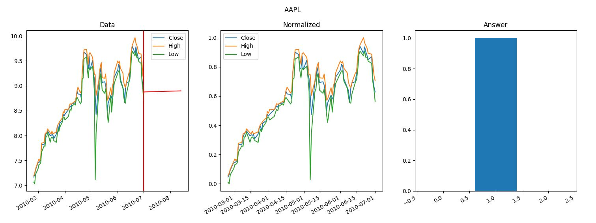

# StockPredictor
Небольшое приложение, которое предсказывает цену акций через 30 дней и выводит результаты предсказаний на графике

## Команды 
- Установка зависимостей: `pip install -r requirements.txt`
- Загрузка и предобработка данных для создания датасета: `python preprocess.py`
- Графически изобразить данные и созданный датасет: `python draw_data.py`
- Протестировать натренированную модель: `python test_model.py`

## Основная функциональность
Изображение данных на графике

## Ссылки
Для создания и тренировки модели используется **NeuralHelper**
https://github.com/kostyanoy/NeuralHelper
